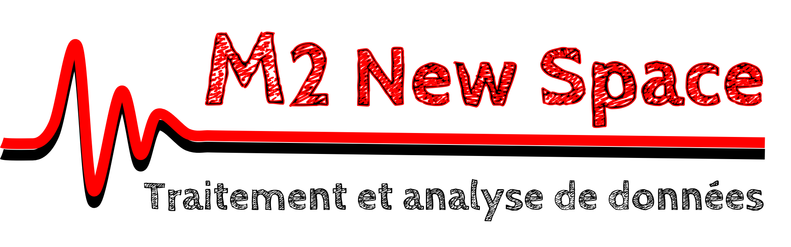

# M2 NewSpace : Traitement de données avec Python

_Cours conçu pour les étudiants du M2 "NewSpace" de l'Université de Versailles Saint-Quentin (UVSQ)_

## Objectifs du cours

Ce cours est une introduction au traitement de données avec Python, dans le but de vous préparer à la suite de l'UE "Analyse de données".

L'objectif est qu'à la fin de ce cours vous soyez capables de :

- Créer un projet Python structuré, avec exemples, tests et documentation en Markdown.

- Importer des données sous Python depuis un fichier ASCII quelconque.

- Manipuler des données sous Python avec Pandas.

- Exporter des données au format CSV, et réaliser des affichages graphiques.

Ce cours sera divisé en 2 temps :

- Un **tutoriel** que vous trouverez sur ce site web, afin de vous former sur un exemple concret.

- Un **projet évalué** lors duquel vous mettrez en application ce que vous avez appris, sur un exemple de votre choix.

## Tutoriel

Le tutoriel proposé sur ce site web est conçu pour vous donner les connaissances et les outils dont vous aurez besoin pour réaliser votre projet évalué.

Il s'agit d'un exemple de projet Python, appliqué à un problème concret lié aux thématiques de votre Master : **le choix d'un satellite GPS de référence à partir d'un fichier d'observations**.

- Si vous n'êtes pas à l'aise avec Python, je vous recommande de suivre ce tutoriel jusqu'au bout lors de la 1ère séance, et si besoin de faire des recherches sur les outils utilisés.

- Si vous êtes à l'aise avec Python, servez-vous plutôt de ce tutoriel pour comprendre ce qui est attendu de vous pour le projet évalué, quitte à en sauter des sections.

Ce tutoriel sera divisé en plusieurs parties :

1. Une mise en contexte sur la navigation GPS.

2. La structure générale du projet Python.

3. Ecriture d'une fonction de lecture de fichiers GPS.

4. Ecriture d'une fonction de traitement des données GPS importées.

5. Ecriture de fonctions pour l'export et l'affichage des données GPS traitées.

6. Ecriture d'un script de tests.

7. Ecriture de la documentation.

## Evaluation

Voici les critères suivant lesquels votre projet sera évalué.

### Rendu de votre projet Python

Durant la séance suivant ce tutoriel, ce sera **à votre tour d'écrire un projet Python**, pour répondre à une problématique de **traitement / analyse de données** de votre choix.

Votre projet devra contenir au minimum :

- La structure de base d'un projet Python (src,docs,examples,test,readme,requirements,setup).

- Une fonction de lecture d'un fichier de données.

- Une fonction de traitement / manipulation des données importées.

- Une fonction d'exportation des données traitées dans un autre type de fichier.

- Une fonction d'affichage des données traitées sous la forme d'un graphique.

- Un script d'exemple utilisant ces fonctions.

- Un script de tests unitaires des fonctions de lecture et de traitement.

- Une documentation Markdown décrivant votre projet et le fonctionnement de vos fonctions.

Vos codes Python **devront être commentés**.

Vous devrez rendre votre **projet Python complet** en fin de séance, **compressé en format zip**.

Vous pouvez réaliser votre projet par binôme ou trinôme, **à condition d'indiquer dans le README le travail réalisé par chacun sur le projet**.

|Utilisation de l'IA générative|
|:-|
|L'utilisation de l'IA générative lors de ce projet est autorisée, à condition de mentionner dans votre README pour quoi vous l'avez utilisée.|
|Pour la génération de code, je pourrais venir vous demander de m'expliquer vos fonctions, pour vérifier que vous comprennez bien ce que vous faites.|

### Présentation orale de votre projet

Lors de la dernière séance, vous devrez faire une **présentation de 10 min** de votre projet, contenant au moins :

- Une présentation rapide de la problématique à laquelle répond votre projet.

- Une présentation du fonctionnement général de votre projet (ce que font vos fonctions), et de comment il répond à votre problématique.

- Une démonstration de votre projet basée sur votre script d'exemple.

- Une explication des tests mis en place pour valider votre projet.

**Je pourrais vous poser des questions pour vérifier que vous comprenez bien ce que vous avez programmé !**

---

## Credits

© Nicolas OUDART