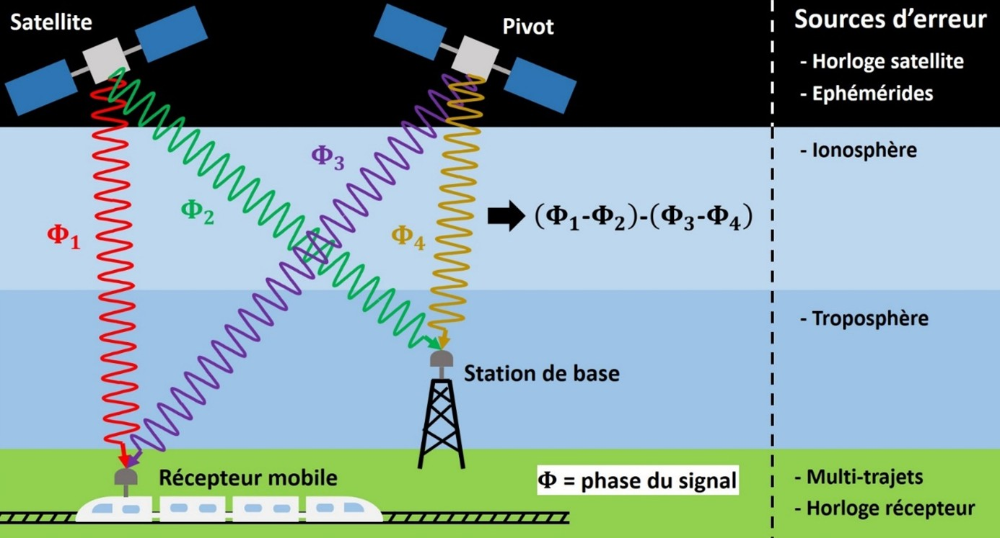
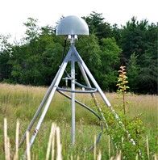
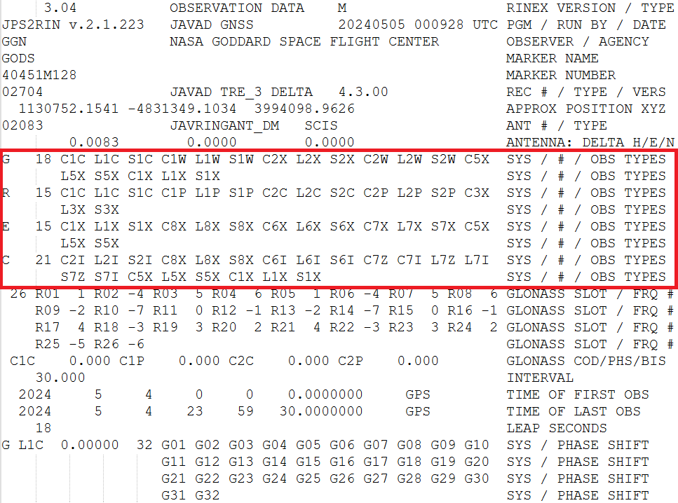
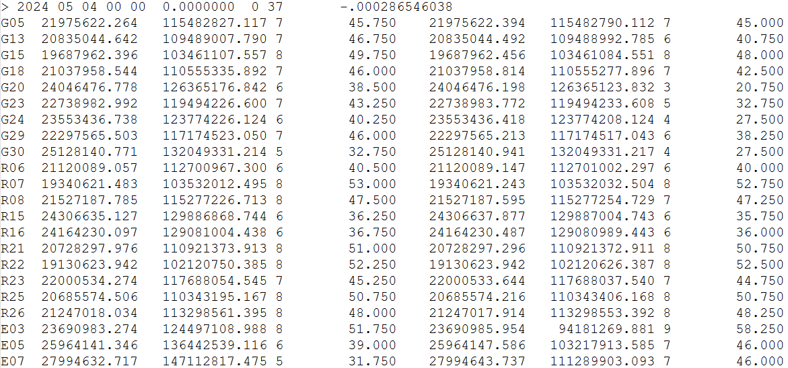

# Etape 1 : Contexte du tutoriel

Lors de ce tutoriel, nous allons créer un module Python pour une application concrète : **la récupération et le traitement de données GNSS**.

---

## GNSS et RTK

|Définition du GNSS|
|:-|
|On appelle GNSS la généralisation du système de positionnement par satellite GPS (américain) à d'autres constellations (GALILEO, Beidou, GLONASS, etc.).|
|Ce sont les initiales de "Global Navigation Satellite System".|

Le principe du **GNSS** est le suivant : utiliser le **temps de retard** entre l’émission de signaux par des satellites et leur réception par un appareil au sol, afin de **localiser** cet appareil.

Pour localiser un récepteur au sol, il faut donc au minimum :

- La **position des satellites**, généralement fournies par l'émetteur sous forme d’éphémérides.

- Les « **pseudo-distances** » entre le récepteur et au moins 4 satellites, calculées par le récepteur à partir des temps de retard de réception des signaux.  

Les mesures de pseudo-distance étant entachées de nombreuses sources d’erreurs (erreurs d’horloges, erreurs d’éphémérides, erreurs atmosphériques, multi-trajets dus à des obstacles, bruits dans les signaux), on obtient en général rarement mieux qu’une précision métrique sur la position du récepteur.

Les formes les plus modernes de navigation GNSS permettent en post-traitement d’obtenir une **précision centimétrique**, en se basant sur la stratégie "Real-Time Kinematics" (**RTK**) :

- Ne pas utiliser les temps de retard pour estimer les distances satellite-récépteur, mais la **phase du signal**, qui est moins affectée par le bruit.

- Utiliser un **satellite de référence** nommé « pivot », afin de compenser par soustraction les erreurs côté récepteur.

- Utiliser une **station au sol de référence** à proximité du récepteur (quelques dizaines de km maximum), afin de compenser par soustraction les erreurs côté satellite.

Voici un schéma de principe de cette méthode :

Une telle méthode nécessite donc :

* Des données issues d'un **réseau mondial de stations de référence** GNSS.

* Un critère de sélection pour le **choix du satellite de référence** ("pivot").

Pour répondre au 1er besoin, des réseaux de stations ont effectivement été mis en place, enregistrant 24h/24 les signaux GNSS avec un pas de 30 ou 1 s, pour les principales constellations GNSS. 
Certains sont privés et vendent ces données, d’autres sont publics et mettent à disposition ces données gratuitement.

L’« International GNSS Service » (**IGS**) est une fédération internationale d’agences / institutions / universités, mettant à disposition les observations de 512 stations situées dans 118 pays. 
Dans le cadre de ce tutoriel, nous allons étudier des données issues d’une station IGS : la **station GODS** appartenant à l’institut « Goddard Space Flight Center » (dépendance de la NASA située dans le Maryland).

Pour répondre au 2nd besoin, les données GNSS contiennent en général un **indicateur de qualité du signal** de chaque satellite, appelé le **C/N0**.

Ce critère permet de comparer le rapport signal sur bruit (SNR en anglais) de satellite fonctionnant sur des bandes de fréquences différentes.
**Plus le C/N0 est élevé, meilleure est la qualité du signal**.

|Objectif du module Python|
|:-|
|Le module Python que nous allons coder dans ce tutoriel permettra de traiter les données C/N0 de la station GODS, afin de choisir un satellite pivot pour chaque mesure GNSS.|

## Fichiers Rinex

Afin de rendre les données des stations de différents réseaux lisibles par tous, un **format standard** a été proposé par l’IGS : le **Rinex**. 

Un fichier Rinex est un fichier **ASCII** (extension .rnx), constitué de :

- Un **en-tête** contenant les méta-données utiles.

- Une **liste des observations** pour chaque satellite visible, à chaque instant d’échantillonnage.

Comme dit précédemment, le fichier Rinex que notre module Python devra lire et analyser est issus de la station GODS de l’institut Goddard (NASA). 

Il s’agit de 24h d’observations GNSS datant du 4 mai 2024, échantillonnées avec un pas de 30 s. 
Il contient des données provenant de 4 stations GNSS : GPS (USA), GLONASS (Russie), GALILEO (Europe) et Beidou (Chine).

Il s’agit du fichier « GODS00USA_R_20241250000_01D_30S_MO.rnx » que vous trouverez [ici](https://github.com/NicOudart/UVSQ_M2_NewSpace_TP_Python/tree/main/example).

Ouvrez le fichier dans un éditeur de texte quelconque.

Vous pouvez voir l'en-tête du fichier, dont la fin est indiquée par la balise "END OF HEADER".

Parmi les méta-données de l'en-tête, on trouve dans le tableau encadré en rouge les types d'observations reçues par GODS.

Il est indiqué que ce tableau contient les informations "SYS / # / OBS TYPES" : 

- La **constellation** : G pour GPS, R pour GLONASS, E pour GALILEO, C pour Beidou.

- Le **nombre** de types d'observations.

- Les **types d'observations**, désignés par leur code.

Le code d'un type d'observation s'écrit avec **3 caractères** :

- Une lettre indicant s'il s'agit d'une **pseudo-distance** (C), une **phase** (L), un **Doppler** (D), ou un **C/N0** (S).

- Un chiffre indicant le **canal de fréquences**. Par exemple, on a 1 pour le canal L1, correspondant à 1575.42 MHz.

- Une lettre indicant l'**encodage des données** : Par exemple, on a C pour un encodage "C/A".

Dans le cadre de ce TP, nous allons nous concentrer sur les observations de C/N0 obtenues pour les satellites GPS, avec le canal de fréquences L1 et un encodage C/A : **S1C**.

Après l'en-tête se trouvent les données proprement dites.

On observe une série de lignes :

- Quand une ligne démarre par >, cela signifie que l’on va donner **une date** sur cette ligne, et que les lignes qui vont suivre contiendront les données d’observations correspondant à cette date. Les 6 premiers chiffres de cette ligne sont : **année – mois – jour – heure – minute – seconde**.

- Les lignes suivantes démarrent par l'identifiant (appelé "PRN") du satellite, puis contiennent les données des observations correspondantes.

Les données sur une lignes sont **dans le même ordre que le tableau donné en en-tête**.
Pour un satellite GPS, on aura par exemple : C1C L1C S1C C1W L1W S1W C2X L2X S2X C2W L2W S2W C5X L5X S5X C1X L1X S1X.

Les observations "S1C" qui nous interessent seront donc sur la **3ème colonne après l'identifiant du satellite**.

## Définition du besoin

Comme mentionné précédemment, pour notre exemple nous allons développer un logiciel qui déterminera le satellite GPS "pivot" à chaque instant pour les observations de GODS.

Lors de ce TP, nous allons donc créer une **bibliothèque Python** qui devra être capable de :

- **Lire** dans un fichier Rinex les **observations S1C** correspondant à chaque satellite GPS, à chaque instant.

- **Stocker** ces observations en fonction du temps et du satellite, dans un tableau.

- Réaliser des **affichages graphiques** de S1C en fonction du temps pour chaque satellite.

- A partir des observations S1C, **déterminer pour chaque instant le satellite "pivot"** idéal.

- **Exporter** sous la forme d'un fichier CSV le satellite pivot choisi pour chaque instant.