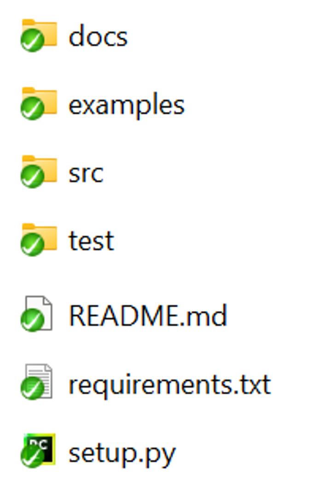

# Etape 1 : Structurer un module Python

Pour commencer, nous allons voir comment structurer un **module Python** de manière à ce qu'il soit importable / utilisable le plus simplement possible.

---

## Structure générale

## Dossier src et Packages

## Dossier docs

## Dossiers examples et test

## Readme

## Requirements

## Setup