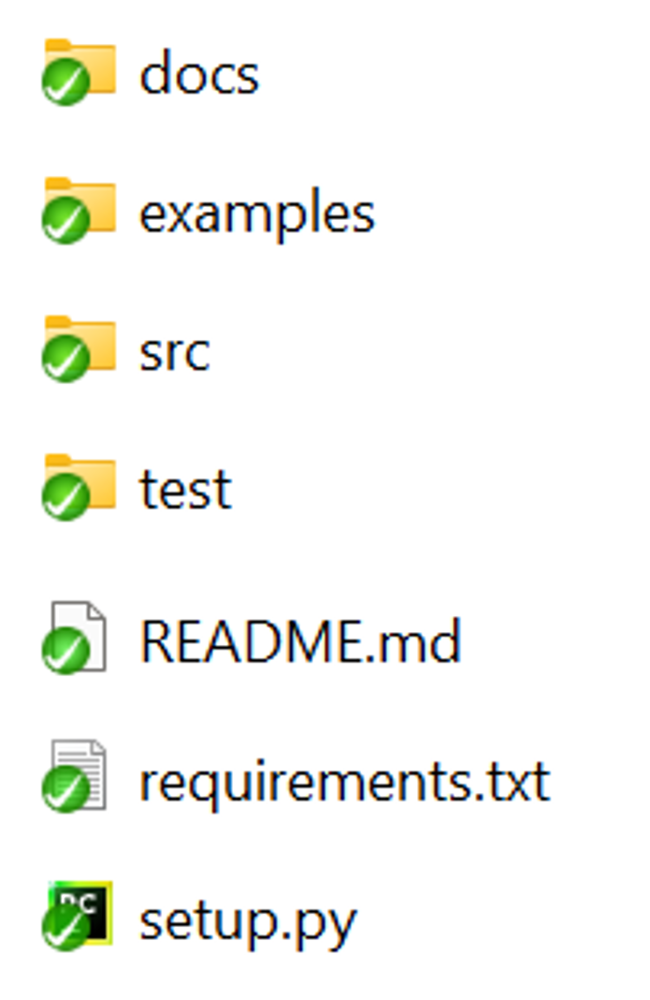

# Etape 1 : Structurer un module Python

Pour commencer, nous allons voir comment structurer un **module Python** de manière à ce qu'il soit importable / utilisable le plus simplement possible.

---

## Structure générale

Il n'y a pas vraiment de règles fixes pour structuration d'un module Python.
Cependant, il y a quelques "bonnes pratiques" suivies par la plupart des développeurs.

En génénal, un module Python est rangé dans un dossier contenant au minimum les éléments suivants :

On y trouve 4 sous-dossiers :

- **src** : qui contiendra les codes sources de notre module, sous la forme d'un **Package**.

- **docs** : qui contiendra la documentation de notre module, en langage **Markdown**.

- **examples** : qui contiendra des scripts Python d'exemple, appliquant les fonctions de notre module à un cas concret.

- **test** : qui contiendra des scripts Python pour tester automatiquement les fonctions de notre module.

Et 3 fichiers :

- **readme.md** : qui contiendra un descriptif rapide du module, en langage **Markdown**.

- **requirements.txt** : qui contiendra la liste des bibliothèques nécessaires à faire fonctionner le module.

- **setup.py** : qui contiendra des informations sur le module, nécessaires à installer le module avec la commande "pip install".

Créez un dossier sur votre ordinateur, du nom de "PyS1C", qui contiendra notre module.

Dans ce dossier, créez des sous-dossiers "src", "docs", "examples" et "test".
Créez aussi des fichiers vides "readme.md", "requirements.txt" et "setup.py".

Dans cette partie du tutoriel, nous allons commencer à remplir ces sous-dossiers et fichiers.

## Dossier src et Packages

## Dossier docs et Markdown

## Dossiers examples et test

## Readme

## Requirements

## Setup