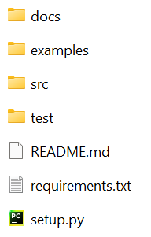
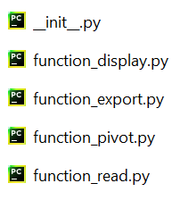
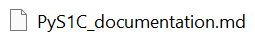
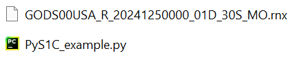
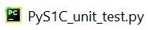

# Etape 1 : Structurer un projet Python

Pour commencer, nous allons voir comment structurer un **projet Python** de manière à ce qu'il soit importable / utilisable le plus simplement possible.

---

## Structure générale

Il n'y a pas vraiment de règles fixes pour structuration d'un projet Python.
Cependant, il y a quelques "bonnes pratiques" suivies par la plupart des développeurs.

En génénal, un projet Python est rangé dans un dossier contenant au minimum les éléments suivants :



On y trouve 4 sous-dossiers :

- **src** : qui contiendra les codes sources de notre projet, sous la forme d'un **Package**.

- **docs** : qui contiendra la documentation de notre projet, en langage **Markdown**.

- **examples** : qui contiendra des scripts Python d'exemple, appliquant les fonctions de notre projet à un cas concret.

- **test** : qui contiendra des scripts Python pour tester automatiquement les fonctions de notre projet.

Et 3 fichiers :

- **readme.md** : qui contiendra un descriptif rapide du projet, en langage **Markdown**.

- **requirements.txt** : qui contiendra la liste des bibliothèques nécessaires à faire fonctionner le projet.

- **setup.py** : qui contiendra des informations sur le projet, nécessaires à installer le projet avec la commande "pip install".

Créez un dossier sur votre ordinateur, du nom de "PyS1C", qui contiendra notre projet.

Dans ce dossier, créez des sous-dossiers "src", "docs", "examples" et "test".
Créez aussi des fichiers vides "readme.md", "requirements.txt" et "setup.py".

Dans cette partie du tutoriel, nous allons commencer à remplir ces sous-dossiers et fichiers.

## Dossier src et Packages

En général, le **code source** d'un projet Python sera rangé dans le dossier "src", sous la forme de **fonctions** (ou de classes en Programmation Orientée Objet).

On peut ranger les fonctions avec 2 niveaux de hierarchisation :

- Un **module** est un fichier Python contenant un ensemble de fonctions.

- Un **package** est un dossier contenant un ensemble de modules.

On peut alors importer n'importe quelle fonction contenue dans un module, lui-même contenu dans un package, de la manière suivante :

~~~
from package.module import fonction
~~~

Vous avez sûrement déjà vu ce type de commandes : c'est ce que vous utilisez pour importer des fonctions de bibliothèques Python telles que Numpy ou Matplotlib.

Pour faire simple dans ce tutoriel, notre projet "PyS1C" ne contiendra qu'un seul package "PyS1C", et chaque module ne contiendra qu'une seule fonction.

Créez un dossier "PyS1C" dans votre dossier "src".

Dans ce dossier, créez les modules vides suivants : 

- "function_read.py"

- "function_display.py"

- "function_pivot.py"

- "function_export.py"

Afin qu'un dossier contenant des modules soit reconnu comme un package, il faut qu'il contienne un fichier "\_init_.py", appelé **initialisateur**.
Comme son nom l'indique, il est executé automatiquement à l'initialisation du package.

Ce fichier peut en théorie être vide, mais on s'en sert souvent pour importer les fonctions de tous les modules du package.

Pour notre tutoriel, créez un fichier "\_init_.py" dans le package "PyS1C", contenant les commandes suivantes :

~~~
from .function_read import read
from .function_display import display
from .function_pivot import pivot
from .function_export import export
~~~

Le package importera ainsi les fonctions des différents modules à son initialisation.

Les fonctions "read", "display", "pivot" et "export" seront définies plus tard dans ce tutoriel.

Votre package a alors la structure suivante :



## Dossier docs et Markdown

En général, la **documentation** d'un projet Python sera rangé dans le dossier "docs", sous la forme de fichers **Markdown**.

Le "Markdown" est un langage de programmation dit de "balisage", comme le HTML, mais à la syntaxe beaucoup plus simple.
Il est couramment utilisé dans le domaine "Open-Source" pour générer la documentation de projets de programmation.

Nous verrons quelques bases de ce langage plus tard dans ce tutoriel.

En attendant, créez dans votre dossier "docs" un fichier Markdown vide "PyS1C_documentation.md" :



## Dossiers examples et test

En général, des scripts Python d'**exemple** et de **test** d'un projet sont rangés dans les dossiers "examples" et "test".

Les scripts d'exemple permettent à un utilisateur d'appliquer les différentes fonctionnalités du projet Python à un **exemple simple**, afin de comprendre rapidement son fonctionnement.

Dans le cadre de ce tutoriel, nous implémenterons un unique script d'exemple, en fournissant un fichier Rinex d'exemple provenant de la station GODS.

Créez dans le dossier "example" un script Python vide "PyS1C_example.py", et ajouter le fichier Rinex qui vous a été fourni [ici](https://github.com/NicOudart/UVSQ_M2_NewSpace_TP_Python/tree/main/example) :



Les scripts de test permettent d'automatiser la phase de test du projet, afin de vérifier qu'une modification n'a pas introduit des bugs ou dégradé les performances. 
Toute la difficulté des tests est alors d'anticiper les cas d'utilisation du projet.

Vous trouverez souvent dans les tests automatiques d'un projet de programmation les 3 types de tests :

- **Tests unitaires** : L'idée est de tester chaque fonction indépendemment.

- **Tests d'intégration** : L'idée est de tester l'articulation des différentes fonctions entre elles.

- **Tests de validation / de performances** : L'idée est de vérifier que le projet est bien conforme au cahier des charges.

Dans le cadre de ce tutoriel, nous n'implémenterons que les tests unitaires, sous la forme d'un unique script Python.

Créez dans le dossier "test" un script Python vide "PyS1C_unit_test.py" :



## Readme

Le fichier "Readme" d'un projet de programmation est en quelque sorte sa "4ème de courverture" : c'est le fichier qui doit absolument **être lu avant d'utiliser le projet**.

Ce fichier contient en général les informations suivantes :

- Description rapide du contenu.

- Comment installer le projet.

- Des mises à jours récentes ou des bugs connus.

- Les crédits, remerciements et licences.

Dans le cas des projets Python, ils sont souvent écrit en langage Markdown.

Ajoutez ce code Markdown à votre fichier "README.md" :

```
#PyS1C

Python project for the selection of the pivot GPS satellite from a Rinex file.

## Overview

PyS1C is a set of tools for the selection of a pivot GPS satellite in the context of Real-Time Kinematics (RTK) positionning.
The C/N0 from L1 GPS signals (S1C) is exctracted from a Rinex file, and the pivot determined at each epoch as the GPS satellite having the highest C/N0.
Results can be output as a figure or as a CSV file. 

## Installation

**Installation:**
~~~
pip install PyS1C
~~~

**Update:**
~~~
pip install PyS1C --upgrade
~~~

**Import:**
~~~
import PyS1C
~~~

## Changelog

- **Version 1.0** : adding 4 functions to the PyS1C package (read, display, pivot, export).

## Support

Contact us at: arthur.dent@latmos.ipsl.fr

## Credits

© Arthur DENT

## License

This package is released under a MIT open source license. 
```

Vous pouvez déjà reconnaitre les différentes sections basiques d'un Readme.
Nous expliquerons la syntaxe du Markdown plus tard dans ce tutoriel, lorsque écrirons la documentation de notre projet.

## Requirements

Lorsque le projet nécessite des **bibliothèques Python** particulières pour fonctionner (pas contenues dans les bibliothèques standards), il est possible de les indiquer dans un fichier "requirements.txt".

Lors de l'installation du projet avec une commande "pip", les bibliothèques manquantes seront automatiquement installées.

Notre projet nécessitera les bibliothèques : "Pandas" pour la manipulation de données, "Matplotlib" pour l'affichage graphique.

Ajoutez donc ces 2 lignes à votre fichier "requirements.txt" :

~~~
pandas
matplotlib
~~~

## Setup

Pour être **installable** avec une simple commande "**pip**", votre projet doit contenir un script "setup.py", passant à une fonction "**setup**" toutes les informations nécessaires à sa **distribution**.

Complétez votre fichier "setup.py" avec le programme suivant :

~~~
from setuptools import setup,find_packages

setup(name='PyS1C',
version='1.0',
description='Python project for the selection of pivot satellite from S1C GPS signals',
long_description=open("README.md").read(),
long_description_content_type='text/markdown',
author='Arthur DENT',
author_email='arthur.dent@latmos.ipsl.fr',
packages=find_packages('src'),
install_requires=open("requirements.txt").read(),
package_dir={ '' : 'src' },
python_requires='>=3.7',
zip_safe=False,
keywords=['GPS','pivot','C/N0','Rinex','S1C'],
classifiers=[
    'Programming Language :: Python :: 3',
    'License :: OSI Approved :: MIT License',
    'Operating System :: OS Independent',
    'Intended Audience :: Science/Research',
    'Topic :: Scientific/Engineering :: Information Analysis'])
~~~

Vous pouvez voir que l'on fourni à la fonction "setup" les informations suivantes sur le projet :

- Le nom.
- La version.
- Une courte description.
- Une longue description (ici le Readme en Markdown).
- L'auteur et son contact.
- Les différents packages (on peut donner une liste de noms, ici on utilise la fonction "find_packages" qui recherche automatiquement les packages dans un dossier).
- Les bibliothèques particulières nécessaires (dans le fichier requirements).
- La version de Python minimale nécessaire.
- Les mots-clés associés.
- Des "classifiers" décrivant à qui s'adresse ce projet : [classifiers](https://pypi.org/classifiers).

D'autres informations peuvent être fournies en entrée de "setup", et certaines ne sont pas obligatoires.

Ce programme s'executera à l'installation de votre projet.

---

Vous avez à présent la structure de base de votre projet !
Dans la suite, nous allons voir comment remplir les fichiers que nous avons laissés vides.